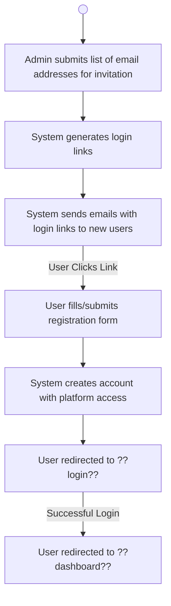
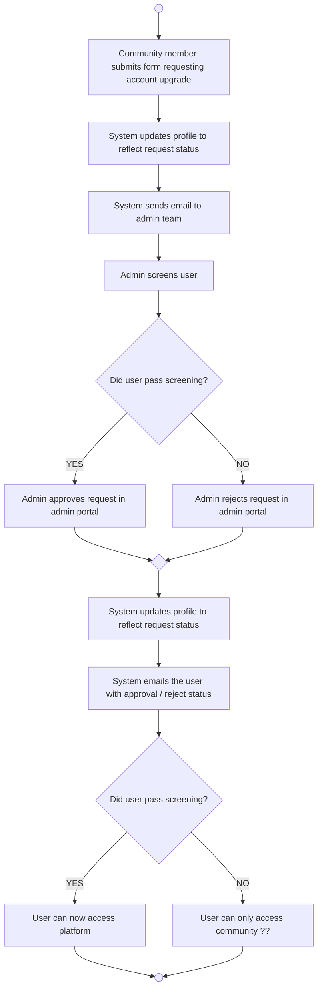

# lgdc-internal-docs

## Admin Targeted Invites

```mermaid
    flowchart TD
        start(( )) --> startInvite[ Admin submits list of email addresses for invitation ]
        startInvite --> generateCodes[ System generates login links ]
        generateCodes --> sendEmails[ System sends emails with login links to new users ]
        sendEmails -- User Clicks Link --> registration[ User fills/submits registration form ]
        registration --> systemRegistration[ System creates account with platform access ]
        systemRegistration --> userLogin[ User redirected to ??login?? ]
        userLogin -- Successful Login --> userDash[ User redirected to ??dashboard?? ]
```

## Existing User Requesting Access

```mermaid
    flowchart TD
        start(( )) --> id2[Community member submits form requesting account upgrade]
        id2 --> id3[System updates profile to reflect request status]
        id3 --> id4[System sends email to admin team]
        id4 --> screening[Admin screens user]
        screening --> id5{ Did user pass screening? }
        id5 -- YES --> id6[Admin approves request in admin portal]
        id5 -- NO --> id7[Admin rejects request in admin portal]
        id6 --> join{ }
        id7 --> join{ }
        join --> id10[ System updates profile to reflect request status ]
        id10 --> id11[ System emails the user with approval / reject status ]
        id11 --> id12{ Did user pass screening? }
        id12 -- YES --> id13[ User can now access platform ]
        id12 -- NO --> id14[ User can only access community ?? ]
        id13 --> close(( ))
        id14 --> close(( ))
        
```
